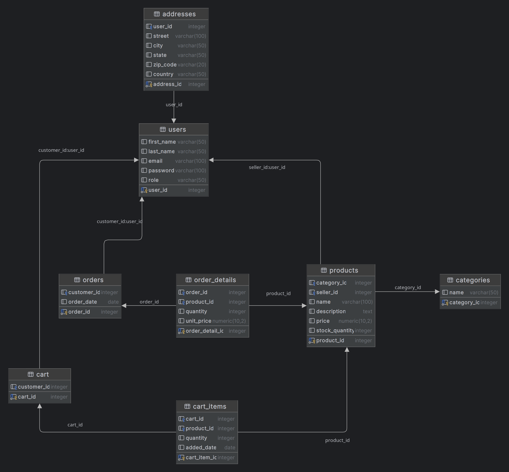

# ecommerce-database
### this is database design and queries for ecommerce .

* DDL 
* DML
* Erd diagram
* Denormalization
* Indexing
* Concurrency control
* Locking
* Isolation levels
* Query optimization techniques
* views

### database erd:

