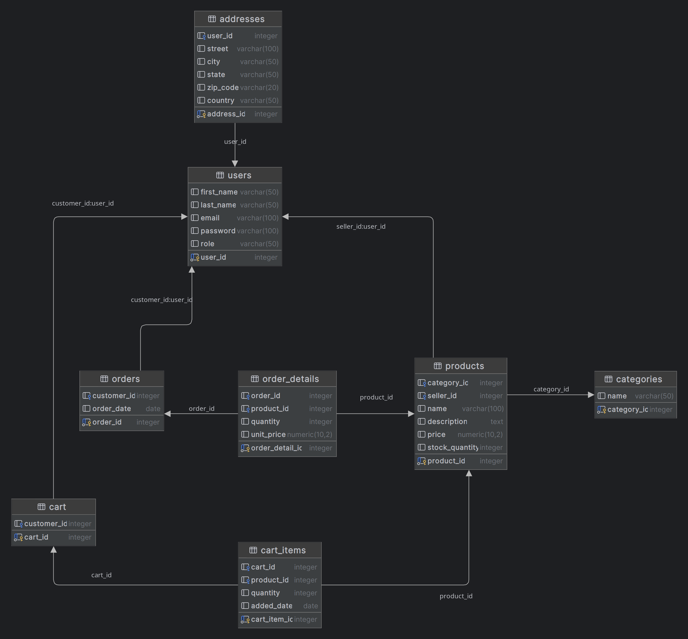

# ecommerce-database
### this is database design and queries for ecommerce .

#### prerequisites:
* postgresql.
* docker or any other sql client.

### Topics:
* DDL 
* DML
* Erd diagram
* Stored Procedures.
* Triggers.
* Denormalization
* Indexing
* Concurrency control
* Locking
* Isolation levels
* Query optimization techniques
* views

### database erd:


### Project Structure:
```
├── Query Optimization Techniques.
│   ├── query_optimization.sql
│   ├── QUERY_OPTIMIZATION_TECHNIQUES.md
│
├── Denormalization
│   ├── denormalization.sql
│   ├── DENORMALIZATION.md
│
├── Indexing
│   ├── create_indexes.sql
│   ├── show_indexes_info.sql
│   ├── INDEXING.md
│
├── Concurrency Control
│   ├── concurrency_control.sql
│   ├── CONCURENCY_CONTROL.md
│
├── Locking
│   ├── locking.sql
│   ├── LOCKING.md
│
├── Isolation Levels
│   ├── isolation_levels.sql
│   ├── ISOLATION_LEVELS.md
│
├── DDL
│   ├── create_table.sql
│   ├── create_procedure.sql
│   ├── DDL.md
│
├── DML
│   ├── dml.sql
│   ├── DML.md
│
├── explain_analyze
│   ├── explain_analyze.sql
│   ├── EXPLAIN_ANALYZE.md
│
├── ERD
│   ├── ecommerce.png
│
├── tasks
│   ├── task1.sql
│   ├── task2.sql
│   ├── task3.sql
│   ├── task4.sql
│   ├── TASKS.md
├── README.md
```

### Database Design:
* Database Name: ecommerce
* Tables:
  * users
  * products
  * orders
  * order_items
  * categories
  * reviews
  * product_reviews
  * cart
  * cart_items
  * addresses

## Read more Details in each topic:

- **Query Optimization Techniques**
  - [query_optimization.sql](./query_optimization_techniques/query_optimization.sql)
  - [QUERY_OPTIMIZATION_TECHNIQUES.md](./query_optimization_techniques/QUERY_OPTIMIZATION_TECHNIQUES.md)
  
- **Denormalization**
  - [denormalization.sql](./denormalization/denormalization.sql)
  - [DENORMALIZATION.md](./denormalization/DENORMALIZATION.md)

- **Indexing**
  - [create_indexes.sql](./indexing/indexing.sql)
  - [show_indexes_info.sql](./indexing/show_indexes_info.sql)
  - [INDEXING.md](./indexing/INDEXING.md)

- **Concurrency Control**
  - [concurrency_control.sql](./concurrency_control/concurrency_control.sql)
  - [CONCURRENCY_CONTROL.md](./concurrency_control/CONCURRENCY_CONTROL.md)

- **Locking**
  - [locking.sql](./locking/locking.sql)
  - [LOCKING.md](./locking/LOCKING.md)

- **Isolation Levels**
  - [isolation_levels.sql](./isolation_levels/isolation_levels.sql)
  - [ISOLATION_LEVELS.md](./isolation_levels/ISOLATION_LEVELS.md)

- **DDL**
  - [create_table.sql](./ddl/create_tables.sql)
  - [create_procedure.sql](./ddl/create_procedure.sql)
  - [DDL.md](./ddl/DDL.md)

- **DML**
  - [dml.sql](./dml/dml.sql)
  - [DML.md](./dml/DML.md)
- **explain_analyze**
  - [explain_analyze.sql](./explain_analyze/explain_analyze.sql)
  - [EXPLAIN_ANALYZE.md](./explain_analyze/EXPLAIN_ANALYZE.md)  

- **ERD**
  - [ecommerce.png](./erd/ecommerce.png)
- **Tasks**
  - [task1.sql](./tasks/task1.sql)
  - [task2.sql](./tasks/task2.sql)
  - [task3.sql](./tasks/task3.sql)
  - [task4.sql](./tasks/task4.sql)
  - [TASKS.md](./tasks/TASKS.md)


