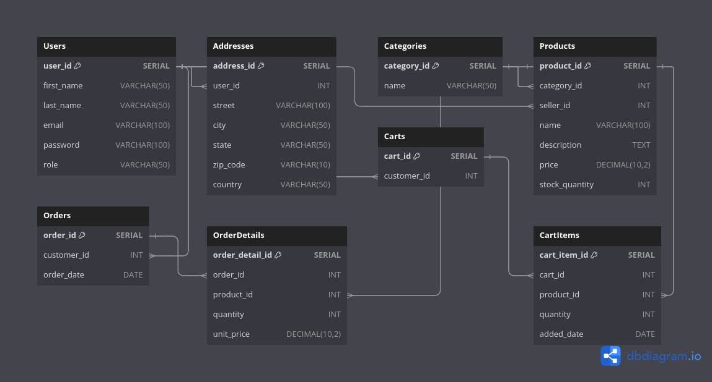

# ecommerce-database
### this is database design and queries for ecommerce .

#### prerequisites:
* postgresql.
* docker or any other sql client.

### Topics:
* DDL 
* DML
* Erd diagram
* Stored Procedures.
* Triggers.
* Denormalization
* Indexing
* Concurrency control
* Locking
* Isolation levels
* Query optimization techniques
* views

### database erd:


### Project Structure:
```
├── Query Optimization Techniques.
│   ├── query_optimization.sql
│   ├── QUERY_OPTIMIZATION_TECHNIQUES.md
│
├── Denormalization
│   ├── denormalization.sql
│   ├── DENORMALIZATION.md
│
├── Indexing
│   ├── indexing.sql
│   ├── INDEXING.md
│
├── Concurrency Control
│   ├── concurrency_control.sql
│   ├── CONCURENCY_CONTROL.md
│
├── Locking
│   ├── locking.sql
│   ├── LOCKING.md
│
├── Isolation Levels
│   ├── isolation_levels.sql
│   ├── ISOLATION_LEVELS.md
│
├── DDL
│   ├── create_table.sql
│   ├── create_procedure.sql
│   ├── DDL.md
│
├── DML
│   ├── dml.sql
│   ├── DML.md
│
├── ERD
│   ├── ecommerce.png
│
├── README.md
```

### Database Design:
* Database Name: ecommerce
* Tables:
  * users
  * products
  * orders
  * order_items
  * categories
  * reviews
  * product_reviews
  * cart
  * cart_items
  * addresses

### Read more:

- **Query Optimization Techniques**
  - [query_optimization.sql](./Query%20Optimization%20Techniques/query_optimization.sql)
  - [QUERY_OPTIMIZATION_TECHNIQUES.md](./Query%20Optimization%20Techniques/QUERY_OPTIMIZATION_TECHNIQUES.md)
  
- **Denormalization**
  - [denormalization.sql](./Denormalization/denormalization.sql)
  - [DENORMALIZATION.md](./Denormalization/DENORMALIZATION.md)

- **Indexing**
  - [indexing.sql](./Indexing/indexing.sql)
  - [INDEXING.md](./Indexing/INDEXING.md)

- **Concurrency Control**
  - [concurrency_control.sql](./Concurrency%20Control/concurrency_control.sql)
  - [CONCURRENCY_CONTROL.md](./Concurrency%20Control/CONCURRENCY_CONTROL.md)

- **Locking**
  - [locking.sql](./Locking/locking.sql)
  - [LOCKING.md](./Locking/LOCKING.md)

- **Isolation Levels**
  - [isolation_levels.sql](./Isolation%20Levels/isolation_levels.sql)
  - [ISOLATION_LEVELS.md](./Isolation%20Levels/ISOLATION_LEVELS.md)

- **DDL**
  - [create_table.sql](./DDL/create_table.sql)
  - [create_procedure.sql](./DDL/create_procedure.sql)
  - [DDL.md](./DDL/DDL.md)

- **DML**
  - [dml.sql](./DML/dml.sql)
  - [DML.md](./DML/DML.md)

- **ERD**
  - [ecommerce.png](./ERD/ecommerce.png)

- [README.md](./README.md)


